# 使用说明

## 进入函数调用图功能

打开平台页面后，点击登录，在左侧导航栏选择 Charts - Graph Chart 进入函数调用图页面，如图所示：

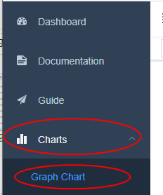

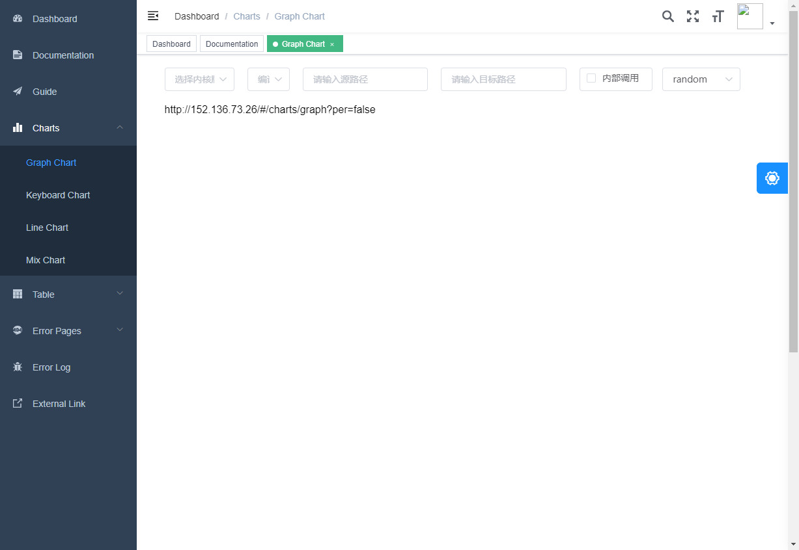

## 设置函数调用图参数

进入 Call Graph模块后，在界面当前可见的一行选项栏中，用户可以选择分析平台的系统参数，可选项分别是内核版本、运行环境（根据内核版本自动加载菜单）、源路径、目标路径、内部调用选项和图布局，全部菜单展开图如下：

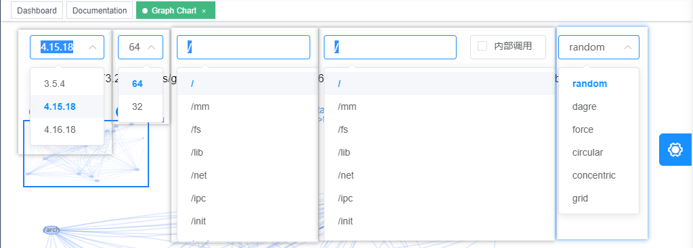

路径菜单，支持输入搜索，用户可以输入完整路径或部分路径进行快速匹配：

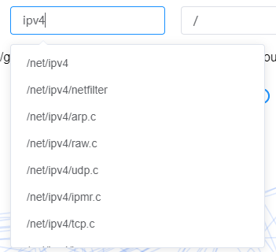

## 查看调用图

当用户选择完函数调用图所需参数后，函数调用图自动加载生成:

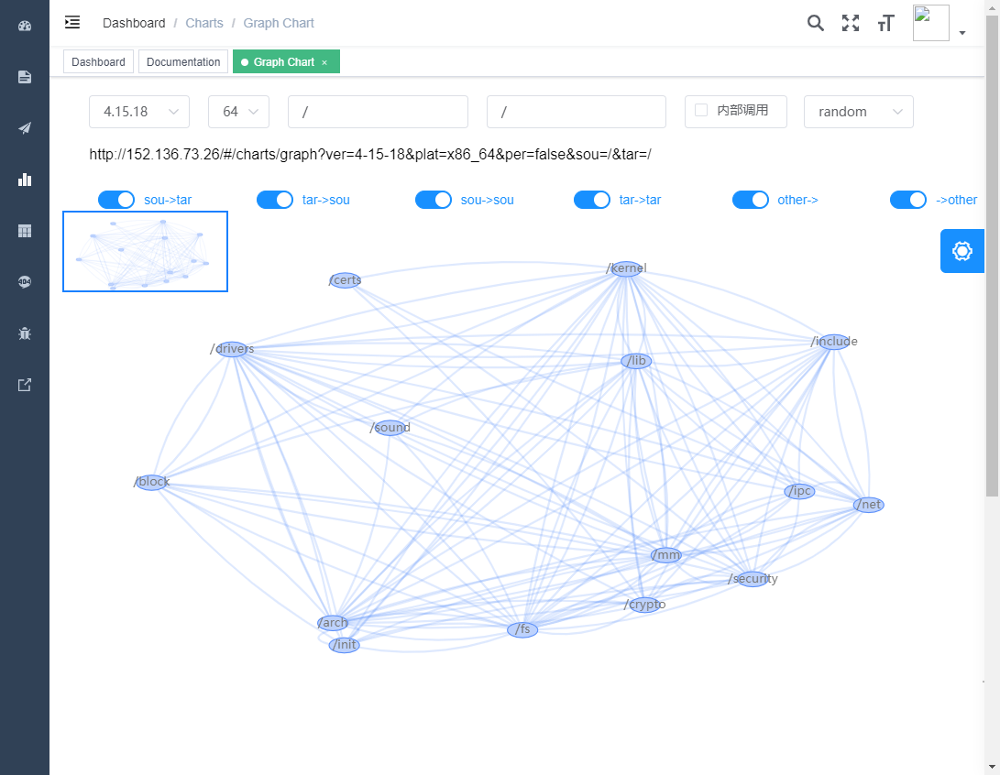

调用图中节点的即为Linux系统中的文件目录（模块），模块与模块之间的边代表模块之间存在调用关系。节点名和边所表示调用关系的详细信息以气泡提示框显示，鼠标悬浮在节点和边上时显示内容如下：

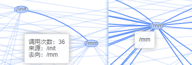

鼠标覆盖边时，高亮边和相邻节点，其他节点和边做半透明处理；鼠标覆盖节点时，高亮节点所有相连节点和相连边，其他节点和边做半透明处理：

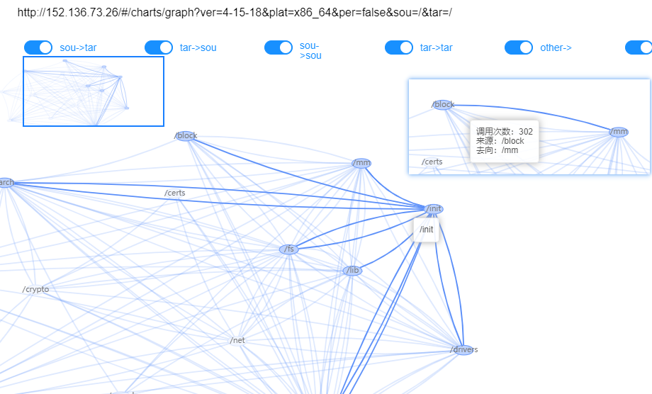

## 调用图边筛选

在调用关系图的上方有开关组件，关闭开关，对调用图中的边进行筛选，隐藏关闭开关对应种类的边：

## 函数调用图节点右键菜单

右键调用图中节点，弹出菜单，如图所示：

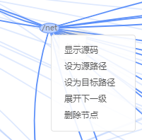

### 显示源码

点击菜单，跳转到外站当前节点所在的路径、文件、函数。

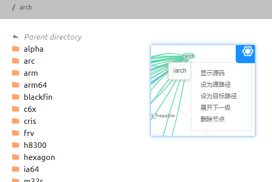

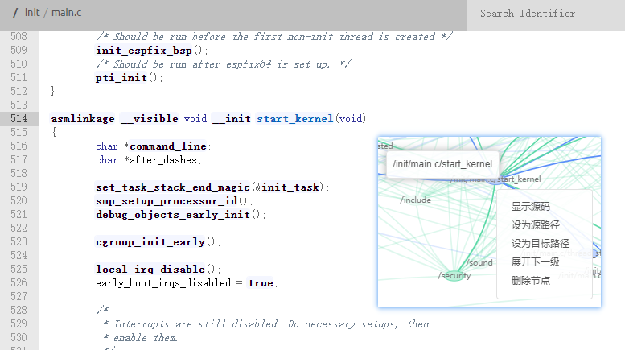

### 设为路径

将当前节点设置为 源 / 目标 路径，加载新数据，更新调用图

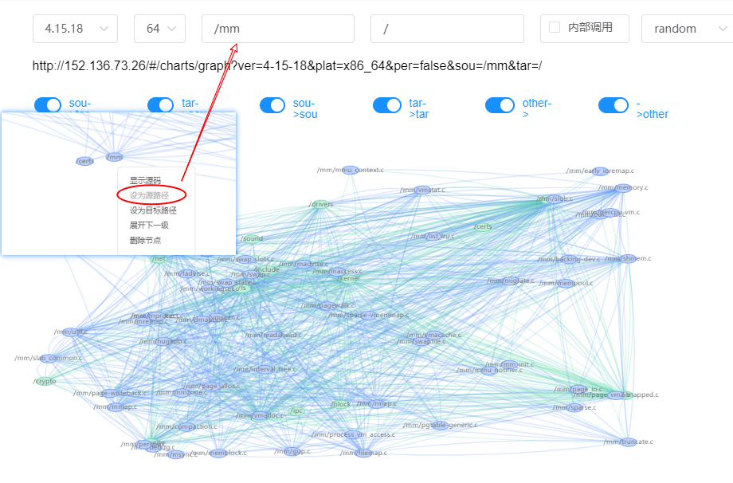

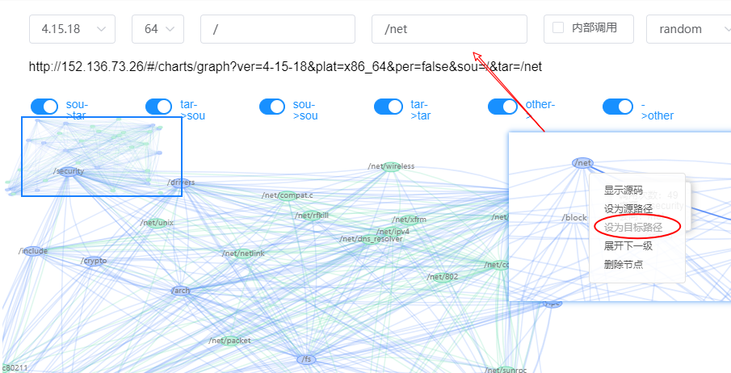

### 展开

加载当前节点的子节点，并显示子节点与当前图中节点的调用关系，忽略子节点直接调用关系

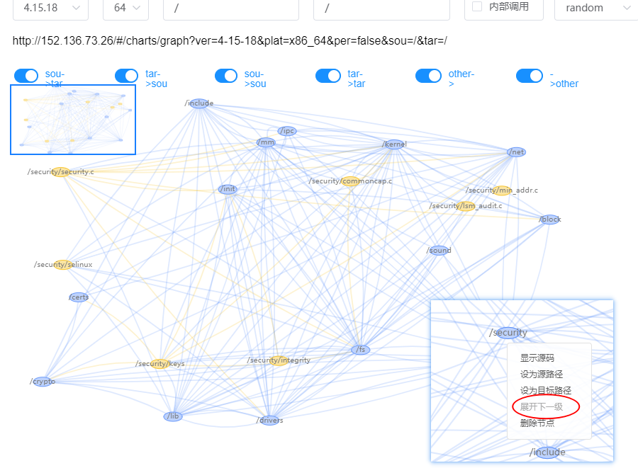

## 函数调用图边右键菜单

右键点击节点之间的边，会弹出菜单，如图所示：

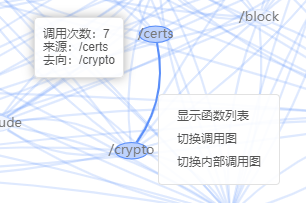

### 显示函数调用列表

显示当前边，源和目标节点的调用表

### 切换调用图

以当前边的源和目标作为调用图切换的两个路径，加载新数据，更新调用图

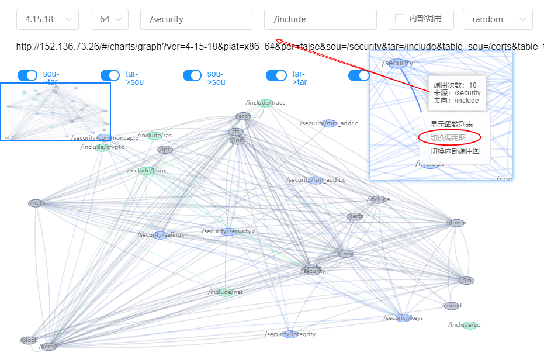

### 切换内部调用图

以当前边的源和目标作为调用图切换的两个路径，只显示两个节点内部子节点的调用关系，加载新数据，更新调用图

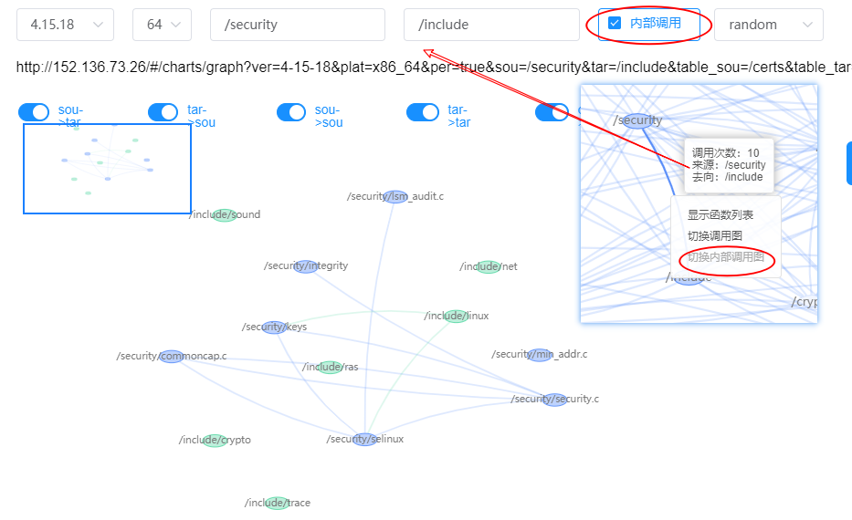

## 画布右键菜单

右键空白区域，弹出菜单

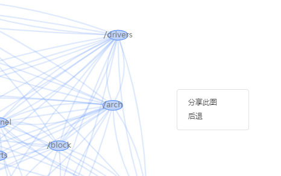

### 分享此图

将当前图上传到服务器，得到分享链接，其他用户打开分享链接可以查看同样的调用图

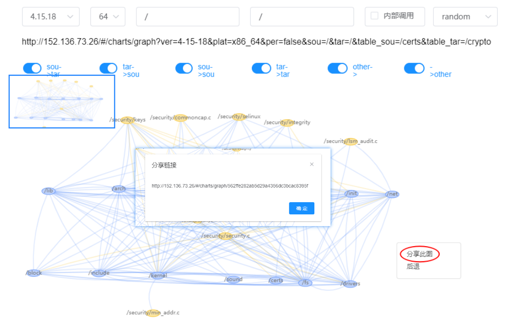

### 后退

返回加载数据操作之前的图，加载数据操作指展开节点、切换路径。

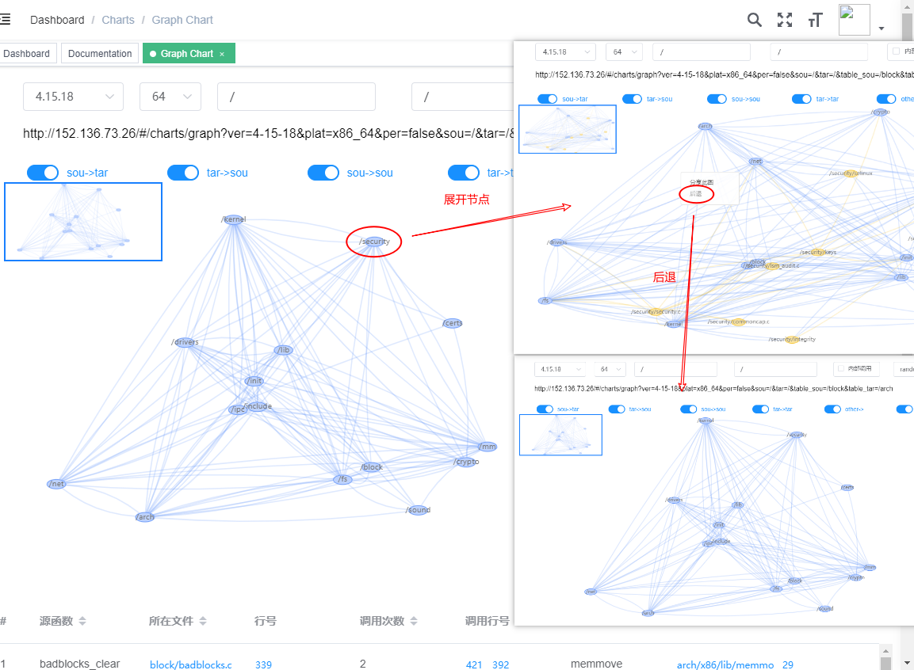

至此，整个Call Graph模块已介绍完毕。
