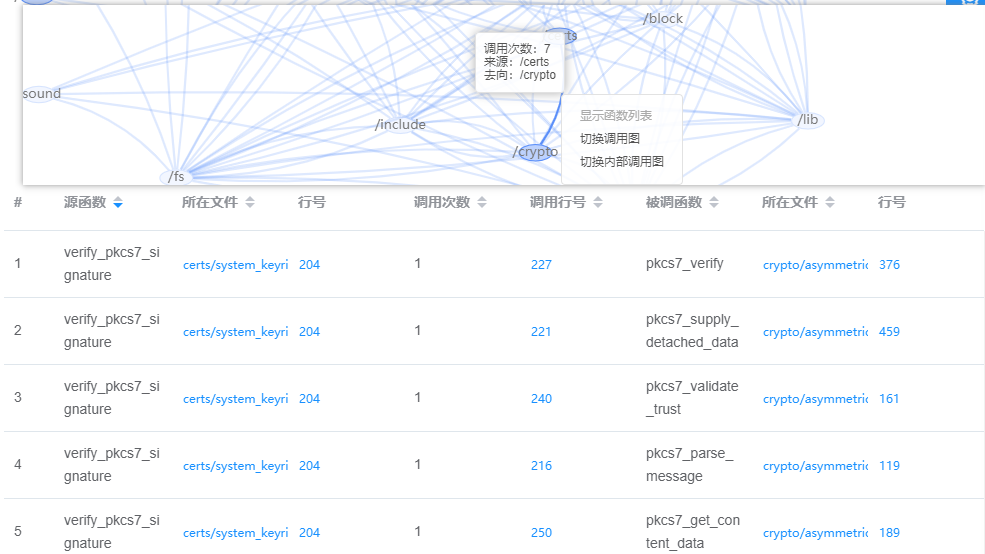
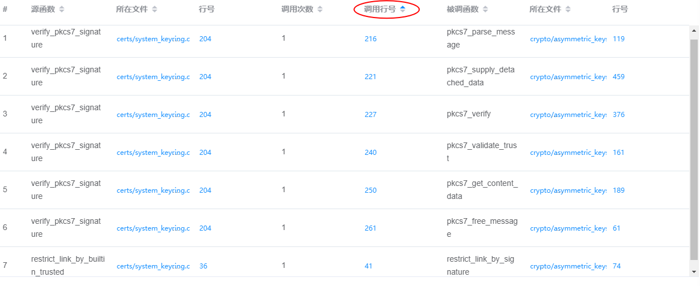
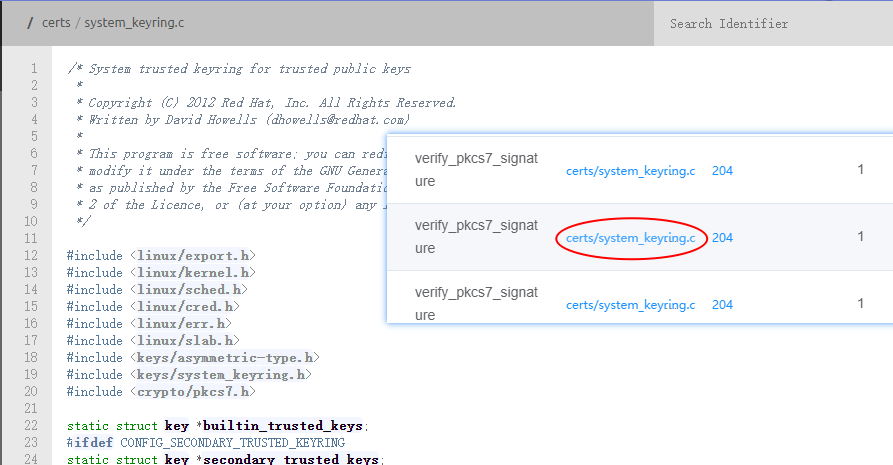
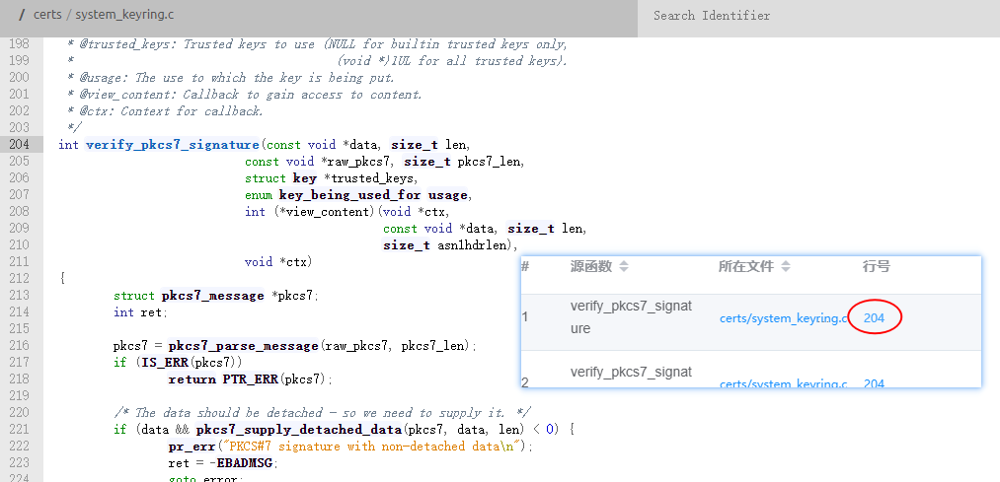

## 使用函数调用表

通过调用图边右键菜单，显示Function List模块，效果如图所示：

调用表依次显示：源函数、源函数所在文件、源函数所在行号、调用被调函数次数、调用行号、被调函数、被调函数所在文件、被调函数所在行号。

## 排序

调用列表中，列名后带有上下三角符号，可点击对应符号，实现对调用表内容进行 `排序`、`降序` 查看。

## 跳转源码

调用表中蓝色字体的文件名与行号，鼠标点击能够跳转对应文件或行号，实现快捷查看源码功能。

