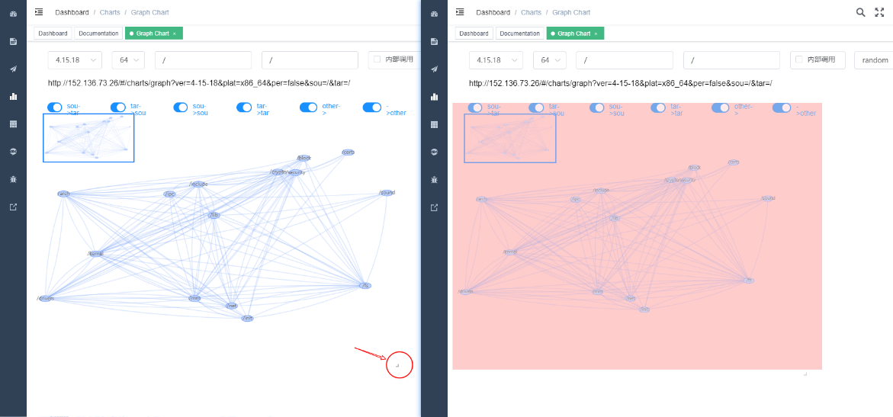
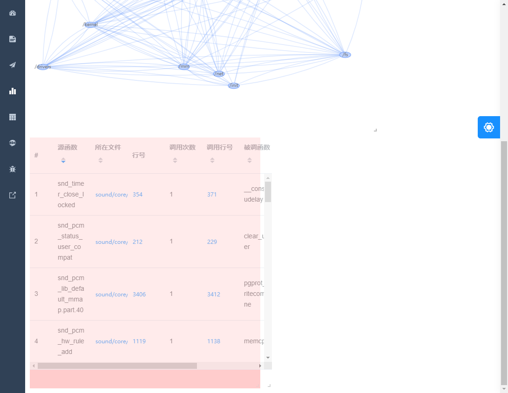
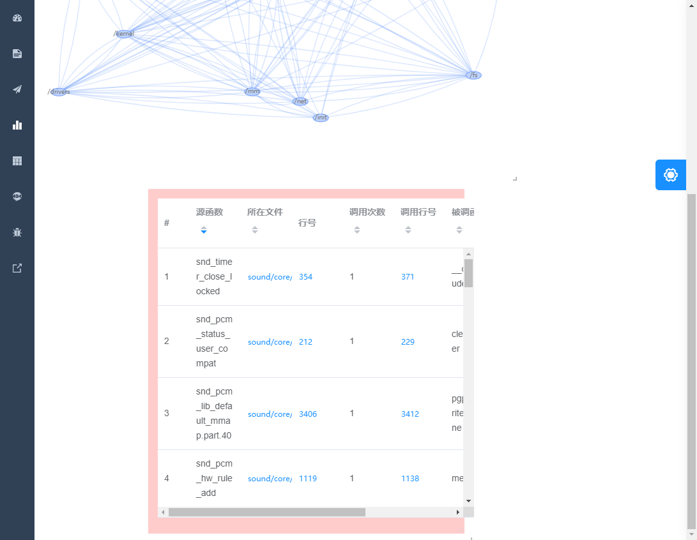

## 自定义布局

打开平台页面后，点击登录，在左侧导航栏选择 Charts - Graph Chart 进入页面

### 函数调用图模块的调整尺寸

通过模块右下角 “ ┛ ” 型图标对模块进行尺寸改变。

### 函数调用表宽度调整和拖拽布局

通过模块右下角 “ ┛ ” 型图标对模块进行尺寸改变。

鼠标悬浮在调用表上时，显示为方向箭头，按住鼠标左键就可以将模块拖拽改变布局位置。

